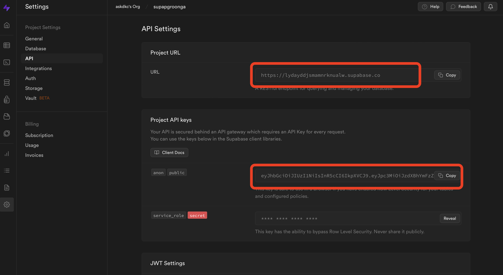

Supabaseで`PGroonga`が使えるので、その使い方の例を紹介します

## まずはサインアップ

まずは[supabase](https://supabase.com)にサインアップしてアカウントを作成し、適当に組織を作り、下記のようなダッシュボードにアクセスしDBを作ります


## ExtensionをONにする

Supabaseは日本語検索に強いPGroongaを使えるので、こいつをONにします

左側のDatabaseのExtensionを開いて検索フィールドにPGroongaと入れると出てきます（左側のPGroongaを選択してね）


## サンプルデータの作成

PGroongaのオフィシャルドキュメントのハウツー内に[「PostgRESTでPGroongaを使う方法」](https://pgroonga.github.io/ja/how-to/postgrest.html)という記事がありますので、これを参考にサンプルデータを作っていきます

- サンプルデータ


```sql
CREATE TABLE memos (
  id integer,
  title text,
  content text
);

INSERT INTO memos VALUES (1, 'PostgreSQLはリレーショナル・データベース管理システムです。','すごいでしょう');
INSERT INTO memos VALUES (2, 'Groongaは日本語対応の高速な全文検索エンジンです。','スゴイデショウ');
INSERT INTO memos VALUES (3, 'PGroongaはインデックスとしてGroongaを使うためのPostgreSQLの拡張機能です。','ハバナイスデー');
INSERT INTO memos VALUES (4, 'groongaコマンドがあります。','今日はコンバンワこんにちわ');

```

- サンプルデータへの検索用`PGroonga`インデックス作成


```sql
CREATE INDEX pgroonga_title_search_index ON memos USING pgroonga (title) 
  WITH (
    normalizers = 'NormalizerNFKC150(
    "unify_to_romaji", true,
    "unify_hyphen_and_prolonged_sound_mark", true
	 )',
    tokenizer='TokenNgram(
      "unify_alphabet", false,
      "unify_symbol", false,
      "unify_digit", false,
      "report_source_location", true
    )',
  );
  
CREATE INDEX pgroonga_content_search_index ON memos USING pgroonga (content) 
  WITH (
    normalizers = 'NormalizerNFKC150(
    "unify_to_romaji", true,
    "unify_hyphen_and_prolonged_sound_mark", true
    )',
    tokenizer='TokenNgram(
      "unify_alphabet", false,
      "unify_symbol", false,
      "unify_digit", false,
      "report_source_location", true
  )',
  );

```

- `PGroonga`検索用ストアドファンクション作成


```sql
-- Title検索用
CREATE FUNCTION find_title(keywords text) RETURNS SETOF memos AS $$
BEGIN
  RETURN QUERY SELECT * FROM memos WHERE title &@~ keywords;
END;
$$ LANGUAGE plpgsql;

-- Content検索用
CREATE FUNCTION find_content(keywords text) RETURNS SETOF memos AS $$
BEGIN
  RETURN QUERY SELECT * FROM memos WHERE content &@~ keywords;
END;
$$ LANGUAGE plpgsql;

```

## アクセス権限の付与

作成した`memos`テーブルに読み取り専用のアクセス権限を設定します


```sql
-- 1. Enable RLS
alter table memos
  enable row level security;

-- 2. Create Policy
create policy "Public memos are viewable by everyone."
  on memos for select using (
    true
);

```

## フロントエンドの準備

Supabaseのオフィシャルドキュメントを参考にSvelteでフロントエンドを作成します：

https://supabase.com/docs/guides/getting-started/tutorials/with-svelte

1. Svelteの準備

```bash
npm create vite@latest supabase-svelte -- --template svelte-ts
cd supabase-svelte
npm install
```
2. `supabase-js`のインストール

```bash
npm install @supabase/supabase-js
```

3. `.env`ファイルの作成

```bash
touch .env
vi .env
```

SupabaseのProject Settings > API からSUPABASE_URLとSUPABASE_ANON_KEYをゲットします



- `.env`の中身に記載

```vim
VITE_SUPABASE_URL=YOUR_SUPABASE_URL
VITE_SUPABASE_ANON_KEY=YOUR_SUPABASE_ANON_KEY
```

4. Supabaseへの接続用クライアントファイル準備

`src/supabaseClient.ts`ファイルを作成し、次の中身を記載：

```ts
import { createClient } from '@supabase/supabase-js'

const supabaseUrl = import.meta.env.VITE_SUPABASE_URL
const supabaseAnonKey = import.meta.env.VITE_SUPABASE_ANON_KEY

export const supabase = createClient(supabaseUrl, supabaseAnonKey)

```

5. 検索用フロントエンド作成

`src/App.svelte`を次のように変更：

```html
<script lang="ts">
  import { supabase } from './supabaseClient'

  let keyword = ''
  let results = []

  const handleSearch = async () => {
    if (keyword.length === 0) {
      results = []
      return
    }

    try {
      const { data, error } = await supabase.rpc('find_title', { keywords: keyword })
      results = data
      if (error) throw error
    } catch (error) {
      if (error instanceof Error) {
        alert(error.message)
      }
    }
  }
</script>

<main>
  <h1>Supabase + Svelte</h1>

  <form on:submit|preventDefault={handleSearch}>
    <input type="text" bind:value={keyword} placeholder="Search for a title">
    <button type="submit">
      Search
    </button>
  </form>
  {#if keyword.length > 0}
    {#if results.length > 0}
      <ul>
        {#each results as result (result.id)}
          <li>
            Title: {result.title}<br>
            Content: {result.content}
          </li>
        {/each}
      </ul>
    {/if}
  {/if}
</main>

<style>
  input {
  font-size: 1em;
  padding: 10px;
  border: 1px solid #ccc;
  border-radius: 5px;
  outline: none;
  transition: border-color 0.3s;
}
</style>
```

6. 動作確認

Svelteをコンパイルしてアクセス

```bash
npm run dev
```

http://localhost:5173 へブラウザでアクセス


検索すると検索結果が下に表示されます(ローマ字で入力しても検索可能！)


